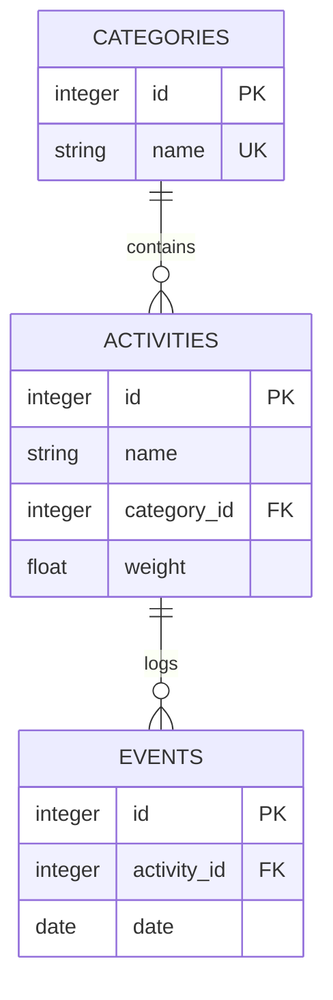

# LifeTracker

LifeTracker is a local, personal-first app for tracking completed actions. Each
click on an activity creates a separate event, so the same activity can be logged
multiple times per day.

## Stack

- Backend: FastAPI, SQLAlchemy, SQLite.
- Frontend: React, TypeScript, Vite.
- Runtime: Docker Compose.

## Run With Docker Compose

```shell
docker compose up --build
```

After startup:

- Frontend: http://localhost:5173
- Backend health check: http://localhost:8000/health
- OpenAPI: http://localhost:8000/docs

SQLite is stored in the `lifetracker_lifetracker-data` Docker volume, so data
survives container restarts.

## Entity Model



## Tables

- `categories`: stores reusable activity categories. `name` is unique.
- `activities`: stores actions the user can log. Each activity belongs to one
  category through `category_id` and contributes `weight` to the daily score.
- `events`: stores each completed action. Every `POST /events` creates a new
  row. If no date is provided, the backend uses the current local date.

The daily score is the sum of `activity.weight` for all events on a calendar
date. The current streak is the number of consecutive days through today with a
daily score greater than zero.

## Manual MVP Check

1. Open http://localhost:5173.
2. Create an activity with a name, category, and weight.
3. Click the created activity several times.
4. Check that `total_events`, `total_score`, and today's heatmap cell increase.

Check the API separately:

```shell
curl http://localhost:8000/health
curl http://localhost:8000/categories
curl http://localhost:8000/activities
curl http://localhost:8000/stats/summary
```

## Local Development

Backend:

```shell
uv run python -m backend.app
```

Backend with reload:

```shell
RELOAD=true uv run python -m backend.app
```

Frontend:

```shell
cd frontend
npm install
npm run dev
```

The frontend API URL is controlled by `VITE_API_URL`; the default is
`http://localhost:8000`.
