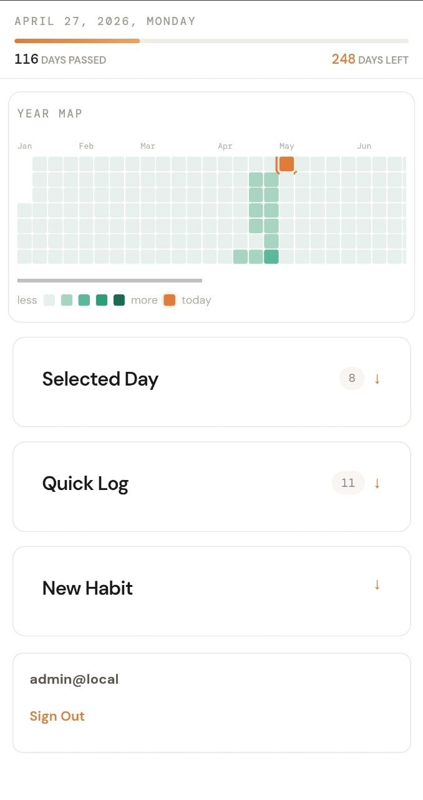
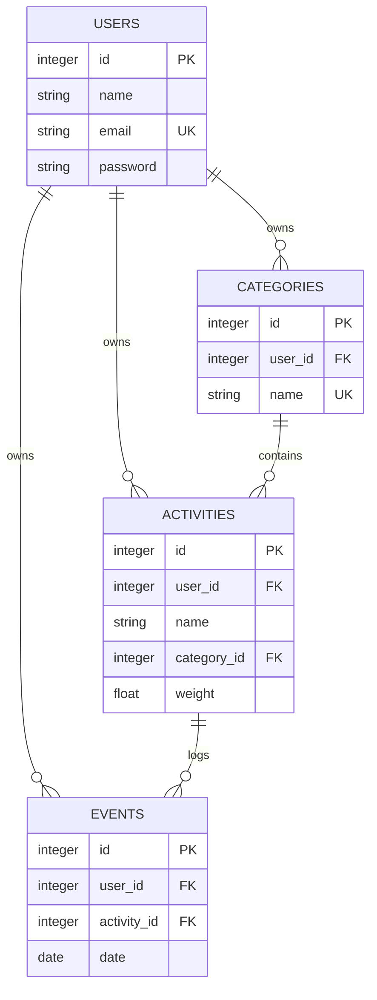

# LifeTracker

LifeTracker is a personal consistency tracker built around a simple idea:
progress is easier to keep when logging it is almost frictionless. It is not a
task manager, calendar, or productivity inbox. It only answers one question:
**did I do the action today, and how consistently am I showing up over time?**

The project was inspired by the contribution tiles on a GitHub profile. That
tiny grid is surprisingly motivating: it turns invisible effort into a visible
pattern. LifeTracker brings that concept into real life, where the "commits" are
workouts, reading sessions, language practice, walks, or any other action worth
showing up for.

It also makes the uncomfortable part visible. Every empty tile is a day when you
were lazy, distracted, or simply chose not to show up. At the same time, the app
shows how many days are still left in the year, so the calendar feels less like
judgment and more like a reminder that there is still time in reserve.

The app is designed for repeated, lightweight actions: workouts, reading,
language practice, walking, meditation, study sessions, or any other habit where
one day can contain more than one meaningful effort.

<p align="center">
  
</p>

## Core Idea

Most trackers treat a day as a checkbox. LifeTracker treats every completed
action as an event. If you work out twice, read twice, or do two study blocks,
both actions are recorded. Each activity has a weight, and the day score is the
sum of all logged activity weights.

This gives a more honest view of momentum:

- one click creates one event;
- multiple clicks on the same day are allowed;
- the heatmap shows intensity, not just presence;
- streaks are based on days with a non-zero score;
- each user has a private activity space.

## What It Shows

The main screen is built around a year-first view. It highlights how much of the
year has passed, how many days are left, and where the active days are clustered.
The goal is to make consistency visible without turning it into project
management.

Main interface pieces:

- **Year heatmap**: a calendar-style grid for daily activity intensity.
- **Today view**: quick action buttons for logging completed activities.
- **Activities view**: activity creation with category and weight.
- **Summary cards**: current streak, active days, total events, and total score.
- **User space**: authentication keeps categories, activities, and events scoped
  to the current user.

## Product Model

LifeTracker has four core entities:

- `User`: owns a private tracking space.
- `Category`: groups related activities, such as sport or learning.
- `Activity`: an action the user can log; it has a weight.
- `Event`: one completed instance of an activity on a calendar date.

The important rule is:

```text
day_score = sum(activity.weight for each event on the date)
```

That means the data model keeps raw facts (`Event`) and derives statistics from
them. This keeps the product flexible: summaries, streaks, and heatmaps are all
computed views over the same event history.

## Architecture



The backend is a FastAPI service backed by SQLite and SQLAlchemy. The frontend
is a React/Vite app focused on a mobile-friendly dashboard. Authentication uses
Bearer tokens, and database migrations are handled with Alembic.

## Current Focus

LifeTracker is still an MVP. The current version prioritizes the core loop:
create an activity, log it quickly, and understand the year at a glance. The
next interesting areas are richer analytics, better mobile polish, and optional
integrations for importing activity signals from external services.
