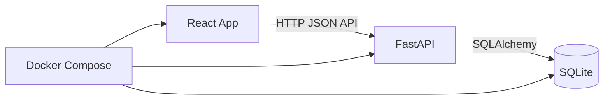

# LifeTracker MVP Development Plan

## Goal

Build a local, personal-first LifeTracker app. The user can create categories,
create activities, log completed actions with one click, and review yearly
consistency through a heatmap, streak, and summary stats.

One activity can be logged multiple times per day. Every click creates a new
`Event`, and the daily score is the sum of the linked activity weights for that
date.

## Architecture



Project structure:

- `backend/`: FastAPI backend.
- `frontend/`: React frontend.
- `docs/`: product and API documentation.
- `docker-compose.yml`: one-command local startup.

## Backend

Initial backend structure:

- `backend/app/main.py`: FastAPI application, CORS, lifespan startup.
- `backend/app/__main__.py`: `python -m backend.app` entrypoint.
- `backend/app/db.py`: SQLite engine and session management.
- `backend/app/logging.py`: centralized logging configuration.
- `backend/app/models.py`: SQLAlchemy models.
- `backend/app/schemas.py`: Pydantic request and response schemas.
- `backend/app/api.py`: MVP endpoints.

The API is small enough to keep in one module. It can be split into routers
later if the surface area grows.

### Models

`Category`:

- `id`
- `name`

`Activity`:

- `id`
- `name`
- `category_id`
- `weight`

`Event`:

- `id`
- `activity_id`
- `date`

`Event.date` is stored as a calendar date, not a timestamp.

### API

- `GET /categories`: list categories.
- `POST /categories`: create a category.
- `GET /activities`: list activities with their categories.
- `POST /activities`: create an activity.
- `POST /events`: create a completed-action event.
- `GET /events?date=YYYY-MM-DD`: list events for one date.
- `GET /stats/heatmap`: return yearly heatmap data.
- `GET /stats/streak`: return the current streak.
- `GET /stats/summary`: return aggregate stats.

### Business Logic

`POST /events` always creates a new event. If `date` is omitted, the backend uses
the current local date.

```text
day_score = sum(activity.weight for each event on date)
```

The current streak:

- counts consecutive days with `day_score > 0`;
- is `0` when today has no activity;
- counts backwards from today until the first empty day.

SQLite and SQLAlchemy are enough for the MVP. Alembic can be added when schema
changes need migrations.

## Frontend

Initial frontend structure:

- `frontend/src/App.tsx`: dashboard composition and data loading.
- `frontend/src/api.ts`: typed API client.
- `frontend/src/components/ActivityForm.tsx`: category-aware activity form.
- `frontend/src/components/ActivityButtons.tsx`: one-click activity logging.
- `frontend/src/components/YearHeatmap.tsx`: yearly heatmap.
- `frontend/src/components/StatsSummary.tsx`: streak and summary cards.

Dashboard:

- activity creation form;
- activity buttons;
- summary cards;
- heatmap for the current year.

When the user logs an activity, the frontend sends `POST /events` with only
`activity_id`, then refreshes summary and heatmap data.

## Docker

Docker setup:

- `backend/Dockerfile`: runs the backend through `python -m backend.app`.
- `frontend/Dockerfile`: runs the Vite dev server.
- `docker-compose.yml`: starts backend and frontend services.
- `.env.example`: documents the relevant environment variables.

Target startup command:

```shell
docker compose up --build
```

The SQLite file is stored in a Docker volume so data is preserved across
container restarts.

## Testing

Backend tests cover:

- category creation;
- activity creation;
- adding an event;
- adding multiple events for one activity on one day;
- default event date;
- daily score calculation;
- heatmap calculation;
- streak calculation;
- summary calculation.

For the first MVP, backend tests plus a manual browser check are enough.

## MVP Acceptance Criteria

- The project starts with `docker compose up --build`.
- A category can be created.
- An activity can be created and linked to a category.
- An activity can be logged with one click.
- Repeated clicks create multiple events.
- The heatmap shows daily activity.
- Streak is calculated from non-zero-score days.
- Summary displays active days, total events, total score, and current streak.
