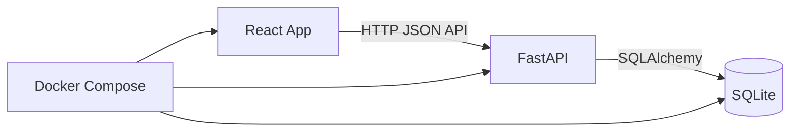

# План разработки LifeTracker MVP

## Цель

Собрать пет-проект LifeTracker: персональное приложение для трекинга факта выполнения действий по направлениям вроде спорта, обучения и языка.

MVP должен позволять:

- создавать активности;
- быстро отмечать выполнение активности;
- видеть heatmap за год;
- смотреть streak и базовую статистику;
- запускать весь проект через Docker Compose.

Важное продуктовое решение: одну и ту же активность можно отметить несколько раз в день. Каждый клик создаёт отдельное событие, а дневной score растёт на `weight` активности.

## Архитектура



Структура проекта:

- `backend/` — FastAPI backend.
- `frontend/` — React frontend.
- `docs/` — описание идеи и план разработки.
- `docker-compose.yml` — запуск frontend и backend одной командой.

## Backend

Стартовая структура backend:

- `backend/app/main.py` — создание FastAPI приложения, CORS, подключение API.
- `backend/app/db.py` — подключение к SQLite, engine, session.
- `backend/app/models.py` — SQLAlchemy модели.
- `backend/app/schemas.py` — Pydantic схемы запросов и ответов.
- `backend/app/api.py` — все MVP endpoints.

На старте не нужен отдельный пакет `routers/`. Один `api.py` проще поддерживать, пока API маленький. Разнести endpoints по файлам можно позже, если проект вырастет.

### Модели

`Activity`:

- `id`;
- `name`;
- `category`;
- `weight`.

`Event`:

- `id`;
- `activity_id`;
- `date`.

`Event.date` хранится как календарная дата без времени, в формате `YYYY-MM-DD`.

### API

Минимальный набор endpoints:

- `GET /activities` — получить список активностей.
- `POST /activities` — создать активность.
- `POST /events` — добавить факт выполнения активности.
- `GET /events?date=YYYY-MM-DD` — получить события за дату.
- `GET /stats/heatmap` — получить данные для годовой heatmap.
- `GET /stats/streak` — получить текущий streak.
- `GET /stats/summary` — получить краткую статистику.

### Бизнес-логика

`POST /events` всегда создаёт новое событие. Если пользователь три раза нажал на одну активность сегодня, в базе будет три события.

Дневной score:

```text
day_score = sum(activity.weight for each event on date)
```

Streak:

- считается по последовательным дням с `day_score > 0`;
- если сегодня нет активности, текущий streak равен `0`;
- если сегодня есть активность, считаем назад до первого пустого дня.

Для MVP достаточно `SQLAlchemy + SQLite` без Alembic. Миграции можно добавить позже, когда схема начнёт меняться.

## Frontend

Стартовая структура frontend:

- `frontend/src/App.tsx` — главный экран.
- `frontend/src/api.ts` — функции для работы с backend API.
- `frontend/src/components/ActivityButtons.tsx` — кнопки активностей.
- `frontend/src/components/ActivityForm.tsx` — форма создания активности.
- `frontend/src/components/YearHeatmap.tsx` — heatmap за год.
- `frontend/src/components/StatsSummary.tsx` — streak и summary.

Главный экран MVP:

- форма добавления активности;
- список кнопок активностей;
- блок статистики;
- heatmap за текущий год.

После клика по активности frontend отправляет `POST /events`, затем обновляет статистику и heatmap.

## Docker

Добавить:

- `backend/Dockerfile`;
- `frontend/Dockerfile`;
- `docker-compose.yml`;
- `.env.example`.

Целевой запуск:

```shell
docker compose up --build
```

SQLite файл лучше хранить в Docker volume, чтобы данные не пропадали после перезапуска контейнеров.

## Тестирование

Backend:

- создание активности;
- добавление события;
- добавление нескольких событий одной активности в один день;
- расчёт дневного score;
- расчёт heatmap;
- расчёт streak.

Frontend:

- загрузка списка активностей;
- создание активности;
- клик по активности создаёт событие;
- после клика обновляются summary и heatmap.

Для первого MVP достаточно backend-тестов и ручной end-to-end проверки через браузер.

## Порядок разработки

1. Инициализировать структуру `backend/`, `frontend/`, `docs/`.
2. Настроить Docker Compose для backend, frontend и SQLite volume.
3. Реализовать backend: база, модели, схемы, API.
4. Добавить backend-тесты на основную бизнес-логику.
5. Реализовать frontend: API-клиент, форма активности, кнопки, статистика, heatmap.
6. Подключить frontend к backend.
7. Проверить сценарий: создать активность, несколько раз отметить её, увидеть рост score.
8. Описать команды запуска и проверки в `README.md`.

## Критерии готовности MVP

- Проект запускается командой `docker compose up --build`.
- Можно создать активность.
- Можно добавить событие по клику.
- Повторные клики по одной активности в один день создают несколько событий.
- Heatmap показывает активность по дням.
- Streak считается по дням с ненулевым score.
- Summary показывает базовую статистику.
